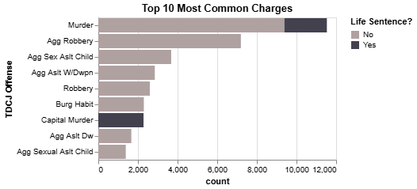
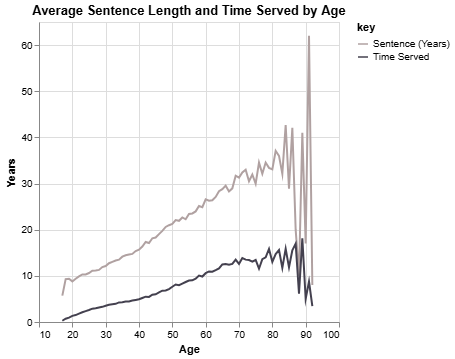
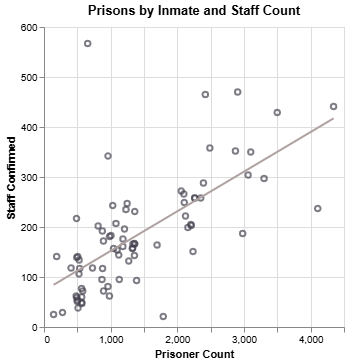
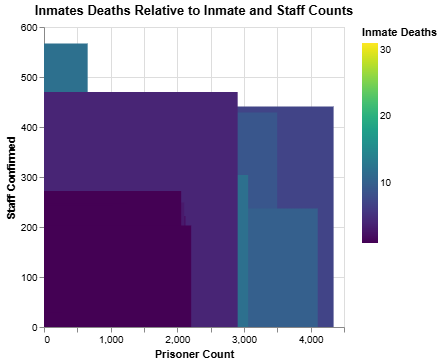
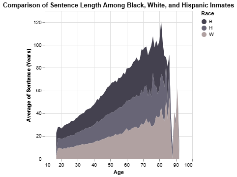
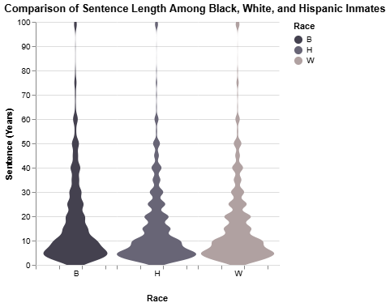
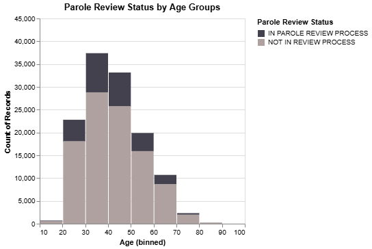
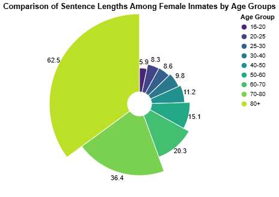

# Life and Death in Texas Prisons

Ganon Evans

## What is your current goal? Has it changed since the proposal?

I think given the tidy data I have, I'm interested in seeing if there's any trends on how old people are in Texas prisons relative to things like their time served, gender, race, and sentence time. However, I'm not thrirlled by this. I want to let the data speak for me and in the graphs I've done so far, I haven't noticed anything particularly interesting. But maybe I'm undervaluing some plain graphs.

## Are there data challenges you are facing? Are you currently depending on mock data?

For this deadline, I was able to build all of my current visuals based on existing data. I may need to do some additional cleaning to account for things like mixed numbers and strings in things like sentence time. 

I probably need to come to office hours this week to get some guidance on how to best do a choropleth with my data and what steps I'd need to walk through. That's the one thing for this deadline I won't have done, but I'd like to do given that I have things like counties. 

## Describe each of the provided images with 2-3 sentences to give the context and how it relates to your goal.

1. 10 Most Common Offenses in Texas Jails

I wanted to start off with just a brief overview of some of the top charge counts in the Texas prison system. I added color defined by whether the inmate is serving a life sentence or not to try and evaluate who may be in the prison system for the longest time. I may change this to include sentences longer than a certain amount too.

2. Age and average length of sentence

This line graph demonstrates the average sentence time and how long prisoners have served at each age. I may need to adjust the graph somehow to account for population size, as only a handful of outliers exist at the older end of the data, but there's much more young people. I also may need to see what a good cutoff point would be given the odd behavior of the graphs at the end.

3. Scatterchart of prisons by number of prisoners and staff

For each Texas prison facility, I plotted the prison population against its facility size and performed a regression to show the general trend of increasing staff for more prisoners. I think for my final project to fit this in with aging, I'm going to use shapes to define prisons with a large population over a certain age and see where they end up.

4. Resident deaths at prisons

I made a heat map of the above data on prisoner and facility counts relative to size. I'm worried this isn't a good graph for several reasons: for one, I just don't think there's enough data to create a very distinguishable final product. I also am not sure how it would fit in with the rest of my narrative.

5. Race on sentence time - stacked area

In part of my exploration of the data, I graphed race on a stacked area chart against sentence times. I think it could be useful to see how race factors into age to see if there's trends, but I don't think this graph is particularly easy to read/make a conclusion from. 

6. Race on sentence time - violin plot

Similar to #5, I like the violin plot more because you can see, for instance, there's a higher density of Hispanic youths with low sentence crimes compared to whites and Blacks. However, at older ages where I want to analyze, the three races selected have very similar shapes to their graph. I wonder if it may be worth while to zoom in more by starting at an older age.

7. Parole review process status versus age histogram?

From the angle of age, I was curious how the amount of parole reviews vary - i.e., if potential there's a point at which people get so old that the reason they're still in prison is due to life sentences more than anything else. I think the histogram with the age buckets looks really clean, and it actually inspired me to think about how age could be used to analyze #1 (i.e., what charges are most likely among prisoners 50+ or so).

8. Radial plot for sentence time for women

I like the idea of doing a radial plot to compare among age groups. As a test, I compared specifically for women the change in sentence times by age bucket. The distinction between who gets old includes gender, so I want to explore that to some degree in my final product.

My choropleth maps are not done, but I plan on having at least 2 in my final project.

## What form do you envision your final narrative taking? (e.g. An article incorporating the images? A poster? An infographic?)

One of the big issues in Texas's prison system right now is the fact that much of their bunks aren't properly air conditioned, which has become insufferable in the summers. I want to contribute the age lens to this to point out potential risk factors of having older people in facilities with improper cooling. I think an article is most like what I have in mind, but I'd need to be more educated on the issues before I start drawing conclusions from this data.