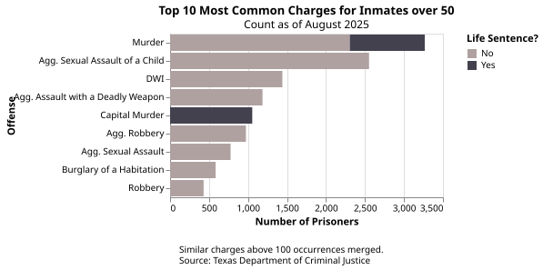
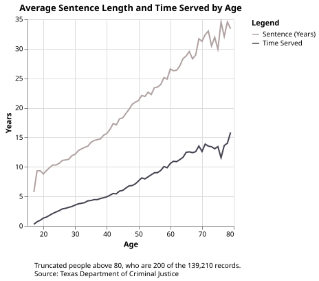
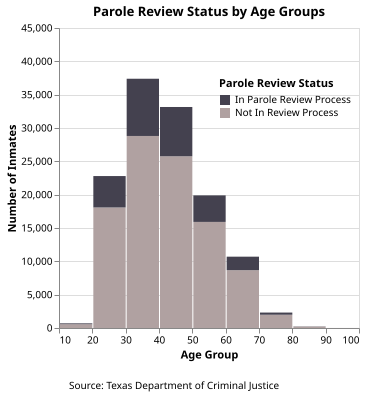
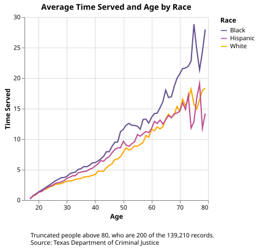
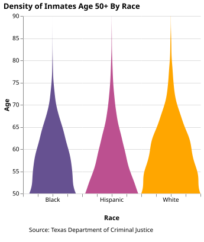
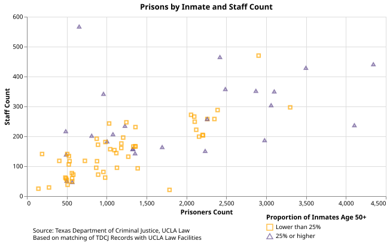

## Introduction

Patrick Womack was a 50-year old inmate at Texas's Coffield prison. On an August in 2023, Womack was found dead in his bunk with 
an internal body temperature of over [106 degrees Fahrenheit](https://www.documentcloud.org/documents/24990424-10-patrick-womack_redacted/). The previous day, the heat index outside reached 113 degrees Fahrenheit.
In his unairconditioned cell, Womack asked a guard for the chance to take a cold shower, but the [guard declined](https://apnews.com/us-news/prisons-crime-texas-general-news-483428d72fdbcbe724700ddf675e15f2) because staff shortages meant there weren't enough people there to watch him.
Though an autopsy report also linked Womack's death to his medical history, heat may have played a significant role. 

As summers get hotter in Texas, many of its prisons lack proper AC for the over 100,000 prisoners there. Given this issue and the existent
lack of medical care in the prison system, I was interested in how one group in particular may fare: the elderly. Older people are more
susceptible to [conditions like heat stroke](https://www.cdc.gov/heat-health/risk-factors/heat-and-older-adults-aged-65.html), and could have chronic conditions made worse by extreme heat. In light of this, I wanted to explore
how the Texas prison system handles older prisoners, what their distribution was, how demographics differed with age, and how facilities differed too.

As a consistent benchmark, I decide to label 50 and older as the demographic I'd be following for this study.

## Who are elderly is in Texas prisons?

As of the Texas Department of Criminal Justice's August 2025 profile, of the 134,303 inmates across 105 facilities, 35,320 of them are age 50 or older.
5.9% of those 50 and older are women, compared to 8.3% among the whole population. The charges for inmates vary in type and expected sentence length, from
things like DWI to sexual assault or murder. 

{fig-align="center"}

By and large, the older someone is in prison, their average sentence length and time served increases. In the data, there was only
200 people above age 80; after age 50, as age increases, the number of inmates dwindles less and less, but significantly so after that point.

{fig-align="center"}

20% of Texas's prisoners are in some stage of parole review. The highest proportion of those in parole review relative to the rest of their age group
is for the 30-40 and 40-50 groups, which are also the highest population deciles in the system. The proportion dwindles more as the deciles get older,
until only a small amount of those over 70 are in the review process at all.

{fig-align="center"}

This means that the oldest groups may consist of people with some of the
longest sentences. [54.8% of people on death row](https://deathpenaltyinfo.org/death-row/death-row-time-on-death-row) across all of the United States are 50 years or older,
and they often spend decades waiting on appeals for their cases. 

:::: {.columns}

::: {.column width="40%"}
The three largest racial groups among inmates are Black, Hispanic, and White. Looking at the relationship between age and tme served all three
groups exhibit the same positive relationship. Yet, after the mid-20s in terms of age, Black inmates on average have served longer terms, then
Hispanic inmates, then White inmates. This implies that many long-term Black inmates may have been imprisoned younger in life and have spent
more time dealing with the resources allocated to them through the prisoner system. A follow-up to this report could connect medical outcomes
among the different races to see if age and length in prison has any correlation.
:::

::: {.column width="60%"}

:::

::::

The density of inmates over age 50 by race takes on similar shapes to one another. White inmates have the highest density on average for all ages, especially in terms of people
who reach age 70+.

{fig-align="center"}

## Facility Comparisons

Of the 24 facilities whose population was 25% or more over the Age of 50, 11 of them had a population of over 2,000. 
Most of the smaller facilities with between 500 to 1,500 prisoners did not have over 25% of their prisoners be over age 50.
The facility with the highest staff to resident ratio is the John Montford Unit in Lubbock, which is a psychiatric facility.

As of 2024, [25% of Texas's guard positions](https://www.texastribune.org/2024/09/11/texas-prisons-staffing-shortages-heat/) are unfilled. Like with the case of
Patrick Womack, this causes inmate needs to go unmet. Some prisoners have been unable to [take showers for months](https://prisonjournalismproject.org/2024/04/18/what-happens-prison-chronically-short-staffed/#:~:text=Over%20a%20decade%20in%20solitary,prison%20system%20sees%20me%3A%20worthless).
Given that so many elderly inmates reside in facilities with larger headcounts but low staff numbers, this could mean that passive and urgent needs go unmet.

Prisons with high elderly populations are concentrated in areas around Southeast Texas - this includes several in the greater Houston metro area and Huntsville,
home to the State Prison and the TDCJ itself. These prisons were also some of the most likely to experience indoor temperatures reaching 100 degrees
Fahrenheit. However, the lowest average indoor temperatures were around 88 degrees Fahrenheit, something most people would find insufferable. As Texas
continues to get [hotter and drier](https://www.kvue.com/article/tech/science/climate-science/texas-hotter-wildfires-climatology-report/269-483d3038-e623-406b-b0e3-b322c0766d35) over the next decade, temperatures in older facilities are likely to continue to grow.

## Conclusion

As Texas's inmates grow older, their likelihood of leaving prisons decreases, whether its from decreased involvement in the parole process or longer sentence times.
This means that the health consequences of aging like routine medical care or regulating cooling systems to not excacerbate chronic conditions falls on the prisons.
Yet, prisoners are often at the bottom of society's list of groups to care for, as evidenced by routine funding cuts and a lack of resources. Nobody 
lives forever, society quietly allows prisoners to forfeit an additional 10 years of their life ontop of their sentence when they're left without something as basic
as air conditioning. When the state takes on the responsibility of rehabilitation and correction of its citizens, it should still remember to support those
citizens within the confines of their sentence. Allowing the old to die from preventable causes like a lack of AC is not justice.

## Data Sources

[UCLA Law Facility Data](https://github.com/uclalawcovid19behindbars/data/tree/master/latest-data)

[Texas Department of Criminal Justice Inmate Dataset](https://data.texas.gov/dataset/High-Value-Dataset-August-2025/9b32-yeu6/about_data)

[Data on Prison Temperatures Acquired by Texas Standard](https://www.texasstandard.org/stories/texas-prison-heat-deaths-lawsuit/)

[Texas State Boundary Shapefile, Texas Department of Transportation](https://gis-txdot.opendata.arcgis.com/datasets/texas-state-boundary/explore)

[FCC FIPs Codes](https://transition.fcc.gov/oet/info/maps/census/fips/fips.txt)

